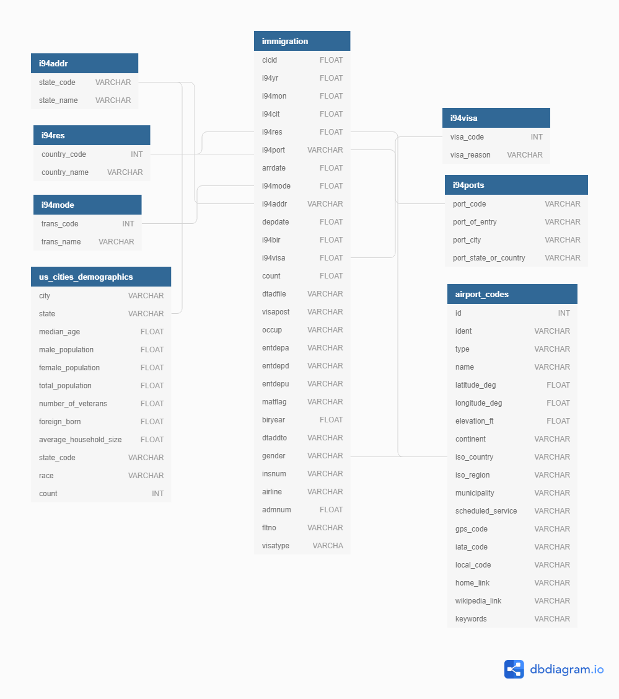
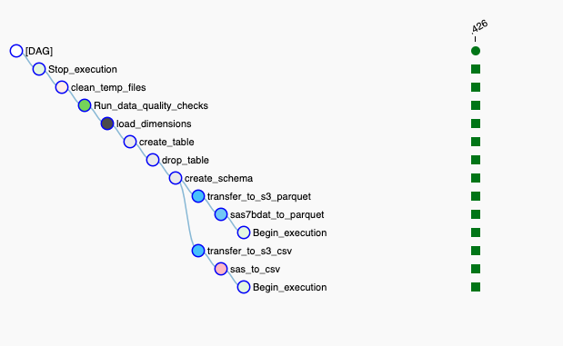
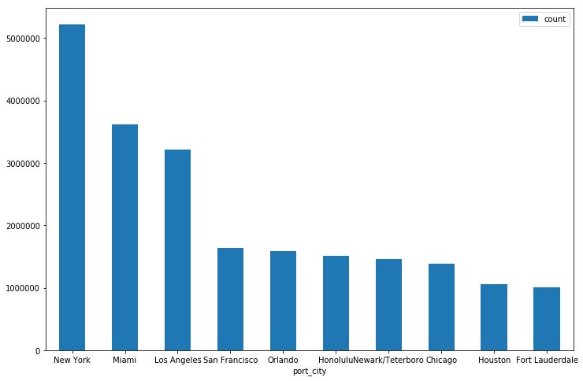
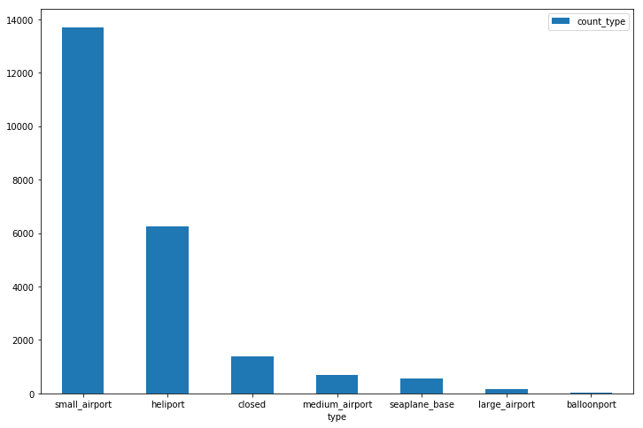
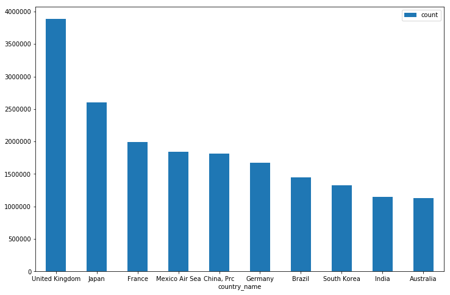
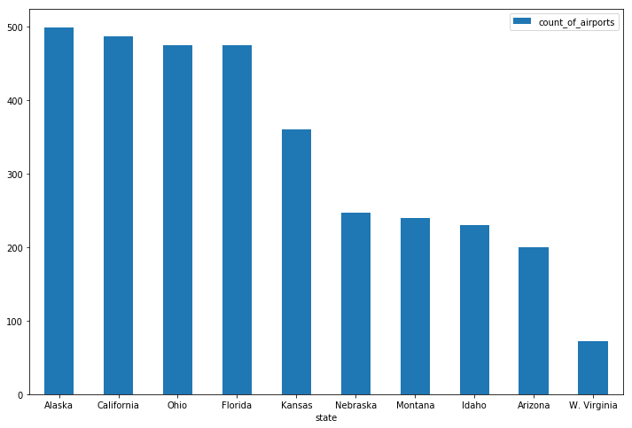

## Data Engineering Capstone Project for Udacity

### Objective  

---
In this project we are going to work with US immigraton data from the 
year 1994. We have facts such as visa types, transport modes, landing 
ports, us state codes, country codes. Apart from the sas7bdat formatted
immigration data we have us airport information and us demographics 
data. We are going to parse SAS descriptor files for all the dimensions 
and sas7bdat files for all the facts. The tools we are going to use here
are Apache Spark, Apache Airflow, Amazon Redshift, Amazon S3. 

We will be reading, parsing and cleaning the data from local file
systems, Amazon S3 and transferring data to redshift tables in AWS. We
will be orchestrating the flow of data through Apache Airflow DAGs. 

Finally we will be using some SQL queries to extract some valuable stats
and graphs from the data itself. 

### Data Model

---


### Data Pipeline

___



### Installing and starting

---

#### Installing Python Dependencies
You need to install this python dependencies
In Terminal/CommandPrompt:  

without anaconda you can do this:
```
$ python3 -m venv virtual-env-name
$ source virtual-env-name/bin/activate
$ pip install -r requirements.txt
```
with anaconda you can do this (in Windows):
```
$ conda env create -f env.yml
$ source activate <conda-env-name>
```
or (in Others)
```
conda create -y -n <conda-env-name> python==3.6
conda install -f -y -q -n <conda-env-name> -c conda-forge --file requirements.txt
[source activate/ conda activate] <conda-env-name>
```
#### Fixing/Configuring Airflow
```
$ pip install --upgrade Flask
$ pip install zappa
$ mkdir airflow_home
$ export AIRFLOW_HOME=./airflow_home
$ cd airflow_home
$ airflow initdb
$ airflow webserver
$ airflow scheduler
```

#### More Airflow commands
To list existing dags registered with airflow
```
$ airflow list_dags
```

#### Secure/Encrypt your connections and hooks
**Run**
```bash
$ python cryptosetup.py
```
copy this key to *airflow.cfg* to paste after   
fernet_key = ************

#### Setting up connections and variables in Airflow UI for AWS
TODO: There is no code to modify in this exercise. We're going to 
create a connection and a variable.  

**S3**
1. Open your browser to localhost:8080 and open Admin->Variables
2. Click "Create"
3. Set "Key" equal to "s3_bucket" and set "Val" equal to "udacity-dend"
4. Set "Key" equal to "s3_prefix" and set "Val" equal to "data-pipelines"
5. Click save  

**AWS**
1. Open Admin->Connections
2. Click "Create"
3. Set "Conn Id" to "aws_credentials", "Conn Type" to "Amazon Web Services"
4. Set "Login" to your aws_access_key_id and "Password" to your aws_secret_key
5. Click save
6. If it doesn't work then in "Extra" field put:  
{"region_name": "your_aws_region", "aws_access_key_id":"your_aws_access_key_id", "aws_secret_access_key": "your_aws_secret_access_key", "aws_iam_user": "your_created_iam_user"} 
7. These are all you can put:
- aws_account_id: AWS account ID for the connection
- aws_iam_role: AWS IAM role for the connection
- external_id: AWS external ID for the connection
- host: Endpoint URL for the connection
- region_name: AWS region for the connection
- role_arn: AWS role ARN for the connection

**Redshift**
1. Open Admin->Connections
2. Click "Create"
3. Set "Conn Id" to "redshift", "Conn Type" to "postgres"
4. Set "Login" to your master_username for your cluster and "Password" 
to your master_password for your cluster
5. Click save

#### Optional
If you haven't setup your AWS Redshift Cluster yet 
(or don't want to create one manually), then use the files
 inside 'aws' folder 
- To create cluster and IAM role: Run the below code in terminal from 'aws' folder to create your Redshift database and a
    iam_role in aws having read access to Amazon S3 and permissions 
    attached to the created cluster
    ```bash
    $ python aws_operate.py --action start
    ```
    copy the DWH_ENDPOINT for <cluster_endpoint_address> and DWH_ROLE_ARN 
    for <iam_role> from the print statements 
- To create Tables: Run the below code in terminal from project dir to create tables in your Redshift database
    in aws 
    ```bash
    $ python create_table.py --host <cluster_endpoint_address>

- To Stop: Run the below code in terminal from 'aws' directory to destroy your Redshift database and
    detach iam_role from the cluster 
    ```bash
    $ python aws_operate.py --action stop
    ```

### About the data

---
#### I94 Immigration Data: 
This data comes from the US National Tourism and Trade Office. 
[This](https://travel.trade.gov/research/reports/i94/historical/2016.html) 
is where the data comes from. There's a sample file so you can take a look 
at the data in csv format before reading it all in. The report contains 
international visitor arrival statistics by world regions and selected 
countries (including top 20), type of visa, mode of transportation, 
age groups, states visited (first intended address only), and the top 
ports of entry (for select countries)

#### World Temperature Data: 
This dataset came from Kaggle. You can read more about it [here](https://www.kaggle.com/berkeleyearth/climate-change-earth-surface-temperature-data).

#### U.S. City Demographic Data: 
This data comes from OpenSoft. You can read more about it [here](https://public.opendatasoft.com/explore/dataset/us-cities-demographics/export/).

#### Airport Code Table: 
This is a simple table of airport codes and corresponding cities. It comes from [here](https://datahub.io/core/airport-codes#data).

### Run the project

---
1. Follow all the setup mentioned above
2. Create a bucket in region 'us-west-2' in Amazon S3
3. You have to setup all the connections and variables in the Airflow
admin  
    i. Setup aws connection with user credentials (access_key and 
    secret_key with login and password)  
    ii. Setup Redshift connection with user, password, host, port, 
    schema, db  
    iii. Setup iam_role for your aws account  
    iv. Setup variables for 'temp_input', 'temp_output', 'spark_path' (spark
    manipulation path for parquet files), sas_file (sas7bdat descriptor 
    files)  
    v. Place all the csv inputs inside temp_output directory   
    vi. Create a folder called 'spark_path' inside \airflow\dags\  
  
    Example:  
    
    | variable     | example value |
    |:-------------|-------------:|
    | iam_role | #### |
    | s3_bucket | #### |
    | sas_file | /home/workspace/airflow/dags/temp_input/I94_SAS_Labels_Descriptions.SAS |
    | spark_path | /home/workspace/airflow/dags/spark_path |
    | temp_input | /home/workspace/airflow/dags/temp_input/ |
    | temp_output | /home/workspace/airflow/dags/temp_output/ |

### Test it Yourself!

---

**Example Queries**
- Get nationalities who were immigrating in decreasing order of people
count
SELECT top 10 b.country_name, COUNT(cicid)
FROM project.immigration a INNER JOIN project.i94res b ON a.i94res=b.country_code
GROUP BY b.country_name
ORDER BY COUNT(cicid) DESC


### Stats and Graphs

---
#### City from where immigrants arrived


#### Different kinds of airports


#### Immigrants from different countries


#### Small airports from different states


### Links for Airflow

---
**Context Variables**  
https://airflow.apache.org/macros.html

**Hacks for airflow**  
https://medium.com/datareply/airflow-lesser-known-tips-tricks-and-best-practises-cf4d4a90f8f  
https://medium.com/handy-tech/airflow-tips-tricks-and-pitfalls-9ba53fba14eb  
https://www.astronomer.io/guides/dag-best-practices/

### Technologies Used


